Contextualização

## Por que Física de Partículas importa?

Touchscreen

<small style="color:#9c9a92">1973 · CERN SPS</small>

Tela sensível ao toque criada para controlar o acelerador SPS.

PET scanner

<small style="color:#9c9a92">anos 1980 · cristais de cintilação</small>

Cristais dos detectores do CERN hoje diagnosticam câncer em hospitais.

World Wide Web

<small style="color:#9c9a92">1989 · Tim Berners-Lee</small>

Inventada para compartilhar dados entre pesquisadores. Hoje conecta bilhões.

Hadronterapia

<small style="color:#9c9a92">1990s · aceleradores médicos</small>

Feixes de prótons destroem tumores com precisão milimétrica.

Computação em grid

<small style="color:#9c9a92">2002 · WLCG</small>

Primeira "nuvem": milhares de computadores processando dados do LHC.

ProtonMail

<small style="color:#9c9a92">2014 · nasceu na cafeteria</small>

E-mail criptografado criado por cientistas do CERN para proteger privacidade.

Pesquisa fundamental gera tecnologia que transforma o cotidiano

